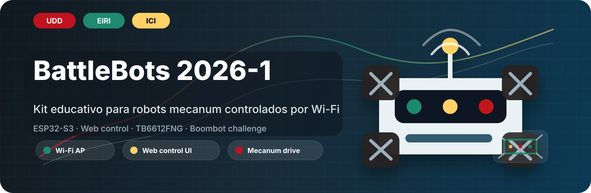

<p align="center">
  
</p>

# battleBots2026-1

<p align="center">
  <strong>Kit educativo de robótica para robots mecanum controlados por Wi-Fi.</strong>
</p>

<p align="center">
  
  
  
  
</p>

## Descripción

`battleBots2026-1` reúne el firmware, documentación técnica y referencias de montaje para un robot tipo **BattleBots / Boombot** desarrollado por **EIRI (Equipo Interdisciplinario de Robótica e Innovación)** junto a **Ingeniería Civil Informática de la Universidad del Desarrollo (UDD)**.

El robot utiliza una **ESP32-S3** como controlador principal. La placa crea una red Wi-Fi local, expone una interfaz web embebida y controla una base mecanum de cuatro motores DC junto a un actuador de ataque por servo.

El proyecto forma parte del ciclo académico **2026-1** y está orientado a talleres prácticos para estudiantes de cuarto medio.

## Características

- Control desde navegador móvil mediante Wi-Fi Access Point.
- Interfaz web embebida con modos `Movement` y `Attack`.
- Joystick táctil para movimiento `X/Y`.
- Botones de rotación con comportamiento press-and-hold.
- Cinemática mecanum para desplazamiento lateral, avance, retroceso y giro.
- Control de 4 motores DC mediante 2 drivers TB6612FNG.
- Servo de ataque conectado a GPIO 11.
- Detención automática por timeout de comandos.

## Estructura del Repositorio

```text
.
├── README.md
├── LICENSE
├── docs/
│   ├── assets/
│   │   └── battlebots-hero.svg
│   └── pinout.md
├── firmware/
│   ├── README.md
│   └── battlebot_controller/
│       └── battlebot_controller.ino
└── hardware/
    └── README.md
```

## Firmware

Sketch principal:

- [`firmware/battlebot_controller/battlebot_controller.ino`](./firmware/battlebot_controller/battlebot_controller.ino)

Plataforma:

| Componente | Valor |
| --- | --- |
| Microcontrolador | ESP32-S3 |
| Framework | Arduino |
| Servidor | `WebServer` embebido |
| Red | Wi-Fi Access Point |

Librerías requeridas:

```cpp
#include <WiFi.h>
#include <WebServer.h>
#include <ESP32Servo.h>
```

## Requisitos

### Herramientas

- Arduino IDE o entorno compatible con Arduino Framework.
- Soporte de placas ESP32 instalado.
- Cable USB para carga y monitor serial.
- Smartphone con navegador web.

### Hardware

| Componente | Cantidad | Uso |
| --- | ---: | --- |
| ESP32-S3 | 1 | Controlador principal |
| TB6612FNG | 2 | Drivers para motores DC |
| Motor DC | 4 | Tracción mecanum |
| Rueda mecanum | 4 | Movimiento omnidireccional |
| Servo 180° | 1 | Actuador de ataque |
| PCB educativa | 1 | Integración del kit |

## Puesta en Marcha

1. Abrir el sketch en Arduino IDE o una herramienta compatible con Arduino Framework.
2. Seleccionar una placa ESP32-S3 compatible.
3. Instalar las librerías requeridas.
4. Cargar el firmware en la ESP32-S3.
5. Energizar el robot con fuentes adecuadas para lógica, motores y actuadores.
6. Conectar un celular a la red Wi-Fi creada por la ESP32-S3.
7. Abrir `http://192.168.4.1` en el navegador.

La configuración de red se define en el firmware.

## Interfaz Web

| Ruta | Vista | Función |
| --- | --- | --- |
| `/` | Menú principal | Acceso a los modos de control |
| `/movement` | Movimiento | Joystick táctil y botones de rotación |
| `/attack` | Ataque | Control del actuador principal |

### Movement

| Control | Rango / comando | Función |
| --- | --- | --- |
| Joystick `X` | `-100..100` | Movimiento lateral |
| Joystick `Y` | `-100..100` | Avance y retroceso |
| `Rotate Left` | `R = -100` | Giro antihorario mientras se mantiene presionado |
| `Rotate Right` | `R = 100` | Giro horario mientras se mantiene presionado |

### Attack

| Control | Comando | Función |
| --- | --- | --- |
| `Attack 1` presionado | `A1_START` | Mueve el servo a posición de ataque |
| `Attack 1` liberado | `A1_STOP` | Retorna el servo a reposo |
| `Stop Attack` | `ASTOP` | Fuerza reposo del actuador |

## API de Control

| Endpoint | Ejemplo | Descripción |
| --- | --- | --- |
| `/joy` | `/joy?x=40&y=80` | Actualiza desplazamiento lateral y avance/retroceso |
| `/rot` | `/rot?r=-100` | Actualiza rotación |
| `/atk` | `/atk?cmd=A1_START` | Ejecuta comandos del actuador |

Rangos esperados:

```text
x: -100..100
y: -100..100
r: -100..100
```

Comandos de ataque:

```text
A1_START
A1_STOP
ASTOP
```

## Modelo de Movimiento

Variables de control:

- `X`: desplazamiento lateral.
- `Y`: avance o retroceso.
- `R`: rotación.

Ecuación de mezcla mecanum:

```text
M1 = Y + X + R
M2 = Y - X - R
M3 = Y - X + R
M4 = Y + X - R
```

Distribución de motores:

| Motor | Posición |
| --- | --- |
| M1 | Adelante izquierda |
| M2 | Adelante derecha |
| M3 | Atrás izquierda |
| M4 | Atrás derecha |

## Pinout

Referencia completa: [`docs/pinout.md`](./docs/pinout.md)

### Motores

| Señal | GPIO | Función | Módulo |
| --- | ---: | --- | --- |
| `M1_IN1` | 5 | Dirección motor adelante izquierda | TB6612FNG #1 |
| `M1_IN2` | 4 | Dirección motor adelante izquierda | TB6612FNG #1 |
| `M1_PWM` | 6 | PWM motor adelante izquierda | TB6612FNG #1 |
| `M2_IN1` | 15 | Dirección motor adelante derecha | TB6612FNG #1 |
| `M2_IN2` | 7 | Dirección motor adelante derecha | TB6612FNG #1 |
| `M2_PWM` | 16 | PWM motor adelante derecha | TB6612FNG #1 |
| `M3_IN1` | 17 | Dirección motor atrás izquierda | TB6612FNG #2 |
| `M3_IN2` | 18 | Dirección motor atrás izquierda | TB6612FNG #2 |
| `M3_PWM` | 38 | PWM motor atrás izquierda | TB6612FNG #2 |
| `M4_IN1` | 39 | Dirección motor atrás derecha | TB6612FNG #2 |
| `M4_IN2` | 40 | Dirección motor atrás derecha | TB6612FNG #2 |
| `M4_PWM` | 41 | PWM motor atrás derecha | TB6612FNG #2 |
| `MOTOR_STBY` | 42 | Standby compartido | TB6612FNG #1 y #2 |

### Actuador

| Señal | GPIO | Función |
| --- | ---: | --- |
| `SERVO_ATTACK1_PIN` | 11 | Señal del servo principal de ataque |

```cpp
SERVO_ATTACK1_PIN = 11
SERVO_REPOSO = 0
SERVO_ATAQUE = 120
```

## Alimentación

- No alimentar el servo desde el pin 3.3V de la ESP32-S3.
- Usar una línea estable de 5V para el servo.
- Compartir GND entre ESP32-S3, drivers, motores y fuente del actuador.
- Validar dirección de motores antes de instalar el mecanismo de ataque.

## Seguridad

El firmware detiene el robot si deja de recibir comandos de control dentro del intervalo configurado.

```cpp
if ((joyX != 0 || joyY != 0 || rotZ != 0) &&
    millis() - lastControlCommand > CONTROL_TIMEOUT) {
  joyX = 0;
  joyY = 0;
  rotZ = 0;
  detenerRobot();
}
```

Recomendaciones de operación:

- Mantener activo el timeout de control.
- Evitar `delay()` en la lógica de movimiento.
- Probar motores y actuador por separado antes de competir.
- Usar una zona despejada durante calibración.

## Ciclo de Talleres

El ciclo 2026-1 está organizado como una construcción progresiva:

1. Introducción al desafío, seguridad y componentes del robot.
2. Revisión de electrónica, motores, actuadores y PCB.
3. Ensamblaje mecánico y conexión de hardware.
4. Firmware ESP32-S3, Wi-Fi AP e interfaz web.
5. Movimiento mecanum, calibración y ataque.
6. Pruebas, ajustes finales y desafío Boombot.

## Créditos

Desarrollado por **EIRI (Equipo Interdisciplinario de Robótica e Innovación)** junto a **Ingeniería Civil Informática, Universidad del Desarrollo (UDD)**.

Ciclo académico: **2026-1**.

## Licencia

Este proyecto se distribuye bajo licencia MIT. Ver [`LICENSE`](./LICENSE).
