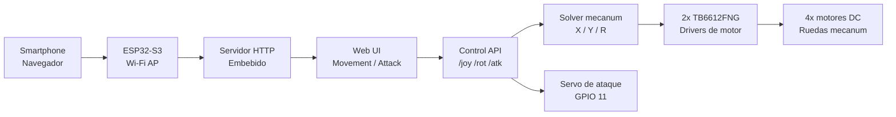

<p align="center">
  
</p>

# battleBots2026-1

<p align="center">
  <strong>Kit educativo de robótica, control web y competencia Boombot para estudiantes de cuarto medio.</strong>
</p>

<p align="center">
  
  
  
  
</p>

## Resumen

`battleBots2026-1` es un proyecto académico desarrollado por el **Equipo Interdisciplinario de Robótica e Innovación (EIRI)** junto a **Ingeniería Civil Informática de la Universidad del Desarrollo (UDD)** para el ciclo **2026-1**.

El proyecto propone un ciclo de 6 talleres donde estudiantes de cuarto medio construyen, programan y prueban robots tipo **BattleBots / Boombot**. Cada robot integra movimiento omnidireccional, control desde smartphone y un mecanismo de ataque orientado a una dinámica competitiva con globos.

La experiencia combina robótica aplicada, electrónica, programación embebida, diseño de PCB, trabajo en equipo y validación experimental en un formato claro, guiado y apto para estudiantes preuniversitarios.

## Producto del Taller

El resultado esperado es una plataforma robótica mecanum/omnidireccional controlada por una **ESP32-S3**. La placa crea una red Wi-Fi propia, sirve una interfaz web local y recibe comandos HTTP desde uno o más celulares conectados al robot.

| Módulo | Propósito | Interacción |
| --- | --- | --- |
| `Movement` | Control de desplazamiento y rotación | Joystick táctil + botones de giro |
| `Attack` | Control del mecanismo Boombot | Botón de ataque + parada manual |
| PCB educativa | Simplificar conexión y montaje | Integración ordenada para talleres |

## Stack Técnico

| Capa | Tecnología | Rol |
| --- | --- | --- |
| Controlador | ESP32-S3 | Control principal, Wi-Fi AP y servidor web |
| Firmware | Arduino Framework | Lógica de movimiento, endpoints y seguridad |
| Red | Wi-Fi Access Point | Conexión directa desde smartphones |
| Interfaz | HTML/CSS/JavaScript embebido | Control táctil desde navegador |
| Motores | 2x TB6612FNG | Control de 4 motores DC |
| Movimiento | Mecanum / omnidireccional | Avance, retroceso, strafing y rotación |
| Ataque | Servo 180 grados | Primer mecanismo Boombot |
| Hardware | PCB educativa | Soporte para armado y operación del kit |

Dependencias principales del firmware:

```cpp
#include <WiFi.h>
#include <WebServer.h>
#include <ESP32Servo.h>
```

## Arquitectura



## Manual de Uso

### 1. Cargar firmware

Abrir el firmware en Arduino IDE o una toolchain compatible con Arduino Framework, seleccionar el perfil de placa ESP32-S3 y cargar el sketch al controlador.

Firmware principal:

- [`firmware/battlebot_controller/battlebot_controller.ino`](./firmware/battlebot_controller/battlebot_controller.ino)

Librerías requeridas:

- `WiFi`
- `WebServer`
- `ESP32Servo`

### 2. Energizar el robot

Usar una alimentación estable para lógica, motores y actuadores. El servo debe alimentarse desde una línea de 5V estable y compartir tierra con la ESP32-S3 y los drivers de motor.

### 3. Conectarse desde un celular

1. Encender el robot.
2. Conectar el celular a la red Wi-Fi creada por la ESP32-S3.
3. Abrir un navegador.
4. Entrar a `http://192.168.4.1`.
5. Seleccionar `Movement` o `Attack`.

> La clave Wi-Fi de operación se configura en el firmware de cada kit. No se publica en este README para mantener la documentación limpia y segura para terceros.

## Interfaz Web

### `Movement`

Pantalla de conducción diseñada para uso táctil en smartphone.

| Control | Comportamiento |
| --- | --- |
| Joystick `X` | Movimiento lateral entre `-100` y `100` |
| Joystick `Y` | Avance/retroceso entre `-100` y `100` |
| `Rotate Left` | Envía `R = -100` mientras se mantiene presionado |
| `Rotate Right` | Envía `R = 100` mientras se mantiene presionado |
| Soltar controles | Vuelve a valores neutros y detiene la acción asociada |

### `Attack`

Pantalla de actuación para el mecanismo Boombot inicial.

| Control | Comando | Resultado |
| --- | --- | --- |
| `Attack 1` presionado | `A1_START` | Mueve el servo a posición de ataque |
| `Attack 1` liberado | `A1_STOP` | Retorna el servo a reposo |
| `Stop Attack` | `ASTOP` | Fuerza la detención/reposo del actuador |

## API de Control

La interfaz web conversa con la ESP32-S3 mediante una API HTTP compacta.

| Endpoint | Ejemplo | Descripción |
| --- | --- | --- |
| `/joy` | `/joy?x=40&y=80` | Actualiza desplazamiento lateral y avance/retroceso |
| `/rot` | `/rot?r=-100` | Actualiza rotación |
| `/atk` | `/atk?cmd=A1_START` | Ejecuta comandos de ataque |

Rangos esperados:

```text
x: -100..100
y: -100..100
r: -100..100
```

Comandos de ataque soportados:

```text
A1_START
A1_STOP
ASTOP
```

## Modelo Cinemático

El robot utiliza un modelo mecanum con tres variables de control:

- `X`: desplazamiento lateral.
- `Y`: avance o retroceso.
- `R`: rotación.

Ecuación validada para las cuatro ruedas:

```text
M1 = Y + X + R
M2 = Y - X - R
M3 = Y - X + R
M4 = Y + X - R
```

Este modelo permite avance, retroceso, desplazamiento lateral, rotación sobre el eje y trayectorias combinadas.

## Referencia de Hardware

| Componente | Cantidad | Nota |
| --- | --- | --- |
| ESP32-S3 | 1 | Controlador principal y servidor web |
| TB6612FNG | 2 | Drivers para motores DC |
| Motores DC | 4 | Base de movimiento mecanum |
| Ruedas mecanum | 4 | Orientación recomendada en patrón X |
| Servo 180° | 1 | Primer mecanismo de ataque |
| PCB educativa | 1 | Soporte de conexión para el taller |

## Pinout

El pinout se mantiene explícito porque es parte crítica del montaje, la depuración y la trazabilidad del kit.

### Motores

| Señal | GPIO | Función | Módulo |
| --- | ---: | --- | --- |
| `M1_IN1` | 5 | Dirección motor adelante izquierda | TB6612FNG #1 |
| `M1_IN2` | 4 | Dirección motor adelante izquierda | TB6612FNG #1 |
| `M1_PWM` | 6 | PWM motor adelante izquierda | TB6612FNG #1 |
| `M2_IN1` | 15 | Dirección motor adelante derecha | TB6612FNG #1 |
| `M2_IN2` | 7 | Dirección motor adelante derecha | TB6612FNG #1 |
| `M2_PWM` | 16 | PWM motor adelante derecha | TB6612FNG #1 |
| `M3_IN1` | 17 | Dirección motor atrás izquierda | TB6612FNG #2 |
| `M3_IN2` | 18 | Dirección motor atrás izquierda | TB6612FNG #2 |
| `M3_PWM` | 38 | PWM motor atrás izquierda | TB6612FNG #2 |
| `M4_IN1` | 39 | Dirección motor atrás derecha | TB6612FNG #2 |
| `M4_IN2` | 40 | Dirección motor atrás derecha | TB6612FNG #2 |
| `M4_PWM` | 41 | PWM motor atrás derecha | TB6612FNG #2 |
| `MOTOR_STBY` | 42 | Standby compartido de drivers | TB6612FNG #1 y #2 |

### Actuador

| Señal | GPIO | Función |
| --- | ---: | --- |
| `SERVO_ATTACK1_PIN` | 11 | Señal del servo principal de ataque |

Referencia del actuador principal:

```cpp
SERVO_ATTACK1_PIN = 11
SERVO_REPOSO = 0
SERVO_ATAQUE = 120
```

Recomendaciones eléctricas:

- No alimentar el servo desde el pin 3.3V de la ESP32-S3.
- Usar una línea estable de 5V para el servo.
- Compartir GND entre ESP32-S3, drivers, motores y fuente del actuador.

## Seguridad Operacional

El firmware debe detener el robot automáticamente si deja de recibir comandos de control. Esto evita movimiento no intencionado cuando se cierra el navegador, se desconecta el celular o cae el enlace Wi-Fi.

Comportamiento recomendado:

```cpp
if ((joyX != 0 || joyY != 0 || rotZ != 0) &&
    millis() - lastControlCommand > CONTROL_TIMEOUT) {
  joyX = 0;
  joyY = 0;
  rotZ = 0;
  detenerRobot();
}
```

Reglas mínimas de operación:

- Mantener un timeout de comandos activo.
- Evitar `delay()` en la lógica de movimiento.
- Mantener el servidor web responsivo mientras el robot está activo.
- Validar dirección de motores antes de competir.
- Probar el actuador sin extensiones peligrosas antes de instalar elementos de competencia.

## Flujo del Ciclo 2026-1

El ciclo está planteado como una construcción progresiva:

1. Introducción al desafío, seguridad y anatomía del robot.
2. Componentes electrónicos, mecánicos y revisión de la PCB.
3. Ensamblaje de chasis, ruedas, motores y conexiones.
4. Firmware ESP32-S3, Wi-Fi AP e interfaz web.
5. Movimiento mecanum, calibración y mecanismo de ataque.
6. Pruebas, iteración y desafío final Boombot.

## Alcance del Repositorio

Este repositorio documenta y evoluciona el kit BattleBots 2026-1. La documentación pública debe ser útil para estudiantes, monitores y revisores externos, sin incluir notas internas, credenciales operacionales o detalles que dependan de una versión específica de la PCB.

Estructura recomendada a medida que el proyecto crezca:

```text
.
├── README.md
├── LICENSE
├── firmware/
│   ├── README.md
│   └── battlebot_controller/
│       └── battlebot_controller.ino
├── hardware/
│   └── README.md
└── docs/
    ├── pinout.md
    ├── assets/
    └── workshops/
```

## Créditos

Desarrollado por **EIRI (Equipo Interdisciplinario de Robótica e Innovación)** junto a **Ingeniería Civil Informática, Universidad del Desarrollo (UDD)**.

Ciclo académico: **2026-1**.

## Licencia

Este proyecto se distribuye bajo licencia MIT. Ver [`LICENSE`](./LICENSE) para más detalles.
